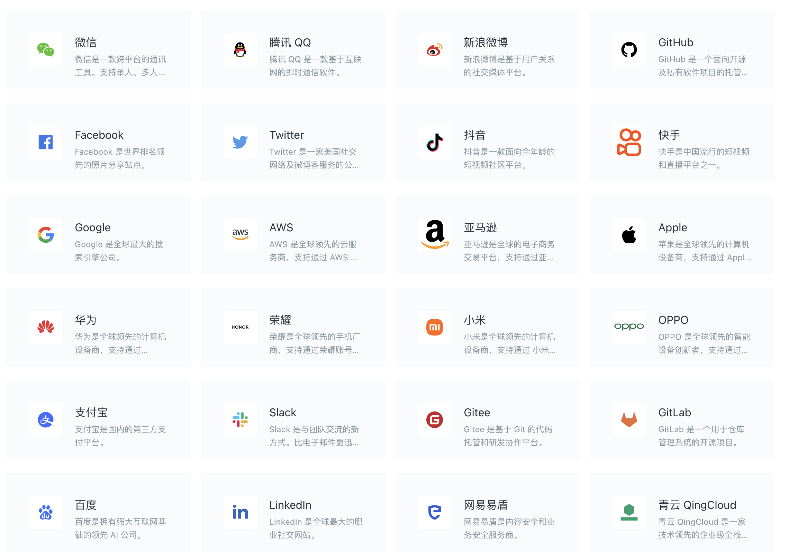

# 第三方社会化身份源



# 集成gitee第三方登录

## 第三方登录的原理

所谓第三方登录，实质就是 OAuth 授权。用户想要登录 A 网站，A 网站让用户提供第三方网站的数据，证明自己的身份。获取第三方网站的身份数据，就需要 OAuth 授权。

举例来说，A 网站允许 Gitee 登录，背后就是下面的流程。

- A 网站让用户跳转到 Gitee。
- Gitee 要求用户登录，然后询问"A 网站要求获得 xx 权限，你是否同意？"
- 用户同意，Gitee 就会重定向回 A 网站，同时发回一个授权码。
- A 网站使用授权码，向 Gitee 请求令牌。
- Gitee 返回令牌.
- A 网站使用令牌，向 Gitee 请求用户数据。

## gitee中创建应用

- 设置中点击【第三方应用】  
  
- 点击【创建应用】  
  
- 填写信息，然后点击【创建应用】  
  

# Grafana浏览器跳转gitee

写了一个html页面，只有一个链接按钮：

要将Gitee作为Grafana的OAuth2提供程序，您需要在Grafana的配置文件(默认路径为/etc/grafana/grafana.ini)中添加以下条目：

```ini
[auth.generic_oauth]  
name = Gitee  
enabled = true  
allow_sign_up = true  
client_id = YOUR_GITEE_CLIENT_ID  
client_secret = YOUR_GITEE_CLIENT_SECRET  
scopes = user_info  
auth_url = https://gitee.com/oauth/authorize  
token_url = https://gitee.com/oauth/token  
api_url = https://gitee.com/api/v5/user  
email_attribute_path = html_url
icon = google
```

请记住，将YOUR_GITEE_CLIENT_ID和YOUR_GITEE_CLIENT_SECRET替换为了在Gitee上注册您的应用程序时获得的值。

## 测试地址

[BOXTRADE天启量化平台-Grafana](http://mac.boxtrade.top:3000)


# 注意

- 回调地址为Grafana工作区的连接地址加`/login/generic_oauth`后缀，例如`http://[Grafana连接地址:端口号]/login/generic_oauth`。您可以在工作区信息页面查看Grafana工作区的连接地址和端口号，更多信息，请参见[创建Grafana工作区](https://help.aliyun.com/zh/arms/observable-visualization-grafana-edition/manage-workspaces#task-2112879)。
  
  

- scope表示权限范围，有以下选项，请求时使用空格隔开
   `user_info projects pull_requests issues notes keys hook groups gists enterprises`


# 参考


[Gitee OAuth 文档](https://gitee.com/api/v5/oauth_doc#/)

[如何对接Grafana实现第三方应用登录_应用实时监控服务-阿里云帮助中心](https://help.aliyun.com/zh/arms/observable-visualization-grafana-edition/use-oauth-to-log-on-to-grafana)

[集成gitee第三方登录 - huihui_teresa - 博客园](https://www.cnblogs.com/huiteresa/p/17627289.html)

[Configure generic OAuth2 authentication | Grafana documentation](https://grafana.com/docs/grafana/latest/setup-grafana/configure-security/configure-authentication/generic-oauth/)


## grafana 三方登录图标icon代码逻辑

1、登录图标的位置     grafana/public/img/icons/unicons/
2、代码 public/app/core/components/Login/LoginServiceButtons.tsx    https://github.com/grafana/grafana/blob/8ec4c1bdc87c43fe43e6bc56db924a9107edf137/public/app/core/components/Login/LoginServiceButtons.tsx#L72
3、默认配置参考 https://github.com/grafana/grafana/blob/8ec4c1bdc87c43fe43e6bc56db924a9107edf137/conf/defaults.ini#L732
4、gitee图标参考 https://gitee.com/about_us


