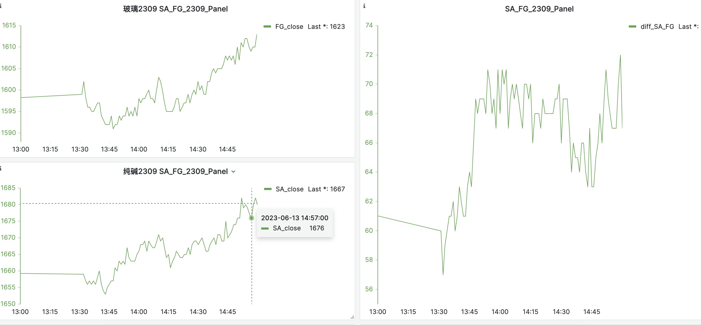

# 2023年02月17日22:43:09

- 空纯碱- 多玻璃 1400差值做到1355 ；这一波真爽！ 

- 交易心态一般 ，其实开局就定义了收成；后面一个多事小时，就是空等；有时候卖出点更是一个学问

> 交易心得
> 
> 用关联产品做套利交易，真的很舒服；减少了赌博的成分，提高了胜率！
> 
> 今天也比较幸运，是在尾盘收尾的时候抢注1400的差值；
> 
> 国内，怎么说呢！ 大家数学都不太好，交易机器人也不多，所以会有很明显的交易参差
> 
> 尾盘，资金不理智的偏向，一般商品间得的基差突破的不是很多，所以，
> 
> 尾盘是个很好的盈利机会，
> 
> 买入的机会要么，卖空买在山顶，至少是目前的山顶；
> 
> 交易原则： 高不做多，低不做空；
> 
> 买多，至少是感觉市场前景乐观的情况下，可等待微微起色再上车也不迟！
> 
> 我们都很贪婪，想吃一整条鱼🐟
> 
> 可是，不切实际的贪婪就要付出代价
> 
> 上涨多了，就要调整，有大周期，小周期
> 
> 同样，下降多了，也要反弹，有小周期，和大周期！
> 
> 最后希望大家都赚钱
> 
> 我喜欢做期货，因为 他能证明你是对还是错，而且很快！

# 玻璃 纯碱套利交易公式

按照以前的认知，数据目前还没有回归测试。发现纯碱，玻璃之间存在一个利差，在1200上下徘徊，但最近出现1420的极值，我在1400做了一个 1:1 的交易，因为一个点是20块钱，所以对冲套利，也把杠杠降低了一倍！所以风险降低了一点。

# 今天看 CCTV-1 的山水间的家

2023年02月17日23:30:25

好羡慕呀，悠哉，自在，充实，轻松自由，精神物质都是享受！

有钱就应该看遍祖国山河，享受自然的美好！

没钱也能享受一点，或者看别人享受。。。。

# 止盈

3%止盈策略，如果跌回，全部卖出！

# 玻璃纯碱 2023年03月08日10:26:27

这一次表现非常好，利用关联产品做一个对冲价差比的交易；有点是 盈利稳定

缺点是：占用本金较大，资金利用率减少一半

有点还是值得肯定的，机会难觅！

这一次交易真的可以

但是发现一个致命问题，机会难觅！寻找机会和机遇的成本太高，程序化，或许能很好解决这个问题！

需要的是一个团队，还是一个机器！

 ？？？ 思考 🤔

### 对冲思考

稳定期内做对冲交易，20日内高点单边空；

20日内低点单边高；

# 2023年03月29日14:27:30

近期性格比较烦躁

交易的时机并不是每时每刻都有，也不是很少；

沉住心，把握趋势，减少试错成本！

# 2023年04月06日14:17:10

最近操盘，浮躁不堪。

没有静下来心研究，老是侥幸的心态。亏损目前有点多，虽然没有杠杆但是亏损达到了10个点，如果有杠杆就爆仓了。

现在 来到了二次支撑线，真的好难。

途中也预料过回到740的支撑线，只是没想到这么快，还在上班，根本没有给自己机会去操作。

操作手法也很拙劣，就是很简单的不停加仓，深不见底的感觉，有点后怕。

再次说明一个问题，浮盈加仓的策略基本是对的，一定周期内，一周，或者两周这样，。

希望逃过这个劫数，现在好处是和机构方向保持一致，

坏处是盘面很难看，真的不知道该如何处置了，再坚持一下吧。

贪婪的韧性，我也觉得能顺利过去，只不过 此时的感觉真是不好受，吃进去的 怎么舍得吐出来呢！！！

# 2023年04月07日10:39:53

试错成本太高了

抄底摸高，方向错误真的是成本巨大。资金上和心理上双重打击

轻仓 短线 风险小一点，

有大势 重仓 基本面和技术面都符合逻辑，做的舒服一点

# 2023年04月07日10:52:15

鸡蛋不要放在一个篮子里

追求稳健，低风险的盈利 

# 2023年04月10日14:18:29

4.扛单，不止损是期货交易者大亏的主要原因。这种情况就是爆仓了，即使不爆仓，也在爆仓的边缘。重仓扛单不止损是期货交易者的恶习。轻仓顺势止损，是千千万万期货交易者总结出来的交易精华，背后有深层次的逻辑，是在实践中总结出来的道理。前几年，我重仓逆势操作了沪镍，伤痕累累，现在心里还拔凉拔凉的。期货交易中的很多道理，没有经历过，是无法体会的，你同意吗？

# 2023年04月10日14:43:24

有点崩溃，躺平算了，每天都不想看见这个盘，

基本面一趟糊涂，技术面也一趟糊涂，总之证明自己错了

还在死扛，但是我不知道，转机在哪里？真的赢不来春天吗？

，，，，，，

心态不要崩，淡定 

2023年04月10日14:44:52

# 启示

没有策略

- 没有止损策略

- 没有事先预测走势

- 盲目入局，不够谨慎

- 死扛的心态很难受 

- 希望有一个好的结果 还没有到逼仓的时候

现在优势

- 跟随机构

- 没有逼仓

劣势

- 和基本面搞反了

- 和技术面趋势也不对

- 没有认错

# 2023年04月10日15:23:36

好生气 搞得没心情 

有点承受不住压力了，上线就是5万 吐出来 全部利润 

看不到一点转机 

真的要死了

# 2023年04月10日15:25:28

晚上计划 

止损5.1w 

止盈3.1w 

2023年04月11日13:29:03

最近做的纯碱差点爆仓 几天巨亏离场 ，真的有一种被玩弄于鼓掌的感觉，基本面庄家说了算，技术指标他帮忙画[破涕为笑]

# 凡事预则立，凡事预则立不预则废

- 执行计划 

- 风险评估

- 概率估算

- 风险控制

- 行情分析 基本面 技术面

- 不要存在侥幸心理 尊重事实

- 不要赌博

# 写交易日记是最重要的

查漏补缺

评估影响

趋势反复检查

# 2023年04月12日10:41:57

顺境也好，逆境也罢，我们都要保持一颗平常心，顺境善待他人，逆境善待自己。顺境的时候，不要自傲自大，瞧不起任何人；逆境的时候，不要自卑自馁，你要相信自己。

做人永远都要记住，善待他人，就是善待自己，善待自己，才能更好地拥抱生活！

2023年04月12日10:49:36

# 道德经·第七十七章

[【作者】老子](https://hanyu.baidu.com/s?wd=老子) 【朝代】春秋时期

译文对照

天之道，其犹张弓欤？

高者抑之，下者举之；有余者损之，不足者补之。

天之道，损有余而补不足。

人之道则不然，损不足以奉有余。

孰能有余以奉天下，唯有道者。

是以圣人为而不恃，功成而不处，其不欲见贤邪。

# 2023年04月12日14:37:29

最近太累了，什么都没做好！ 善待自己，善待他人！

好好学习，天天向上！ 

工作的激情

# 2023年04月24日08:59:17

FG2309 基本面和技术面一致，看涨

尾盘买了个跌 震荡整理中。。。 执行不一

知行不一 内心纠结 

# 2023年04月24日16:07:25

fg2309 9:27 有个诡异的三分钟触底 创造 1770的一周最低 ，后续14:33 飙升到1866 前后一百点的价差 ，三分钟尾盘boll 下方 冲高1845 过中线 ，

基本面现货飙升 ，基本面看好

今天震荡 

日线周线依然有回归趋势 

玻璃纯碱2309 基差来到300 大关 ，一路下来 

2023年04月24日16:38:36

https://baijiahao.baidu.com/s?id=1719287637498041341&wfr=spider&for=pc

SA2009 纯碱成本

 1300 1800 

浮法玻璃17.5万吨日熔量+光伏4万吨日熔量，一共21.5万吨，每天消耗重碱21.5*0.2=4.3万吨，一周消耗重碱30.1万吨。重碱和轻碱比例各占50%，玻璃厂安全库存是30天，

很多做基本面交易的朋友，赚得时候容易大赚，亏得时候也容易大亏。主要是他们没有真正理解盘面，**盘面立足于基本面，但又高于基本面。基本面分析是用来赚大钱的，但技术分析是用来保命的。**

# 2023年04月25日09:16:09

顺基本面做长线

不和基本面一致 ，做日线

不要丧失自己独立思考和沉着冷静的心态 

2023年04月25日10:49:43

不贪盈利，风险还是有点高

顺势下虽然能创造更多利润，但是忽略了回撤对收益的影响，合理的方式还是 移动均线法，及时调整盈利，或者收手

制定盈利策略

交易策略

逆势 和基本面不一致 做好 止盈 止损

顺势 注重风险，做好止损，力求筹码价格最低

微小盈利，巨大亏损，数据真的很丢脸

# 2023年04月27日15:06:15

这个尾盘偷得 一下子 又走了30个点，我他妈 郁闷了

犹豫止损的过程中 被偷家了

轻视了交易 

# 2023年05月12日09:49:42

最近心态不太好，社区里戏谑的 点还是那个点，钱没了！

不要玩成赌博，伤身！

最近心态要调整下了，发下 少个理财工具

做实时资金曲线 使用 

# 2023年05月12日16:29:58

胜率大时，逐步加大盈利成本

胜率小时，逐步试错；

切勿重仓 一下子建仓 

# 2023年05月16日09:48:36

最近脑袋有点乱，一切乱糟糟的；整理一下心情；节奏明显能感觉不对了。

停下来，静下心来做。

# 2023年05月17日09:38:12

来回输，真的·有点麻，无所依据；来回被收割！

罪了，罪了 

说实话 我慌了；；

短线一定不要做长线的事情；；

纪律严格；；

思想好混乱，输怕了，一下子就乱了阵脚。总是质疑自己，离场不坚定。

做的交易像是赌博一样，杜绝，杜绝；

有坚定的分析方法，不要想墙头草一样摇摆不定；坚定不移的相信自己，错也错的理直气壮。

绝对不会就这么停下来的，多空的博弈还没结束，胜者一定会再来执行自己的逻辑，改变的概率很小；并且市场传闻房地产信息是不容乐观的，基本面和趋势都向下，短暂的繁荣，说明不了什么！ 

反思，市场的容忍度，，交易的合理性；执行计划的制定，内部交易逻辑梳理；趋势的判断；

建议的主观性与客观性。。

# 2023年05月17日10:58:18

不要低空

不要高多

价格短时间回不来，很煎熬。

瑟瑟发抖的时候，前景不明的时候 就要空仓；；空仓；；

现在心态真的不是一般的乱，瑟瑟发抖中；

# 2023年05月17日14:40:09

悔恨的眼泪，1620的空单FG2309没有平 

# 三酸两碱

，即硝酸（HNO₃）、硫酸（H₂SO₄）、盐酸（HCl）和氢氧化钠NaOH、碳酸钠。但碳酸钠不是碱，是盐，俗称纯碱、苏打，显碱性。

酸是由氢元素和酸根组成的化合物如：硫酸、盐酸（HCl）、硝酸碱是由金属元素和氢氧根组成的化合物如：氢氧化钠、氢氧化钙、氨水盐是由金属元素元素（或铵根）和酸根组成的化合物如：氯化钠、碳酸钠。

# 2023年05月19日10:16:56

有毒 啥也没干 亏钱了 

怎么做都是错的 真是很有意思 

差点崩溃 

失去了清醒的大脑 

愿我们每一个期货投资者都能：临盘稳得住，交易稳得住，亏损稳得住，盈利稳得住，拥有一个稳定的投资收益  

作者：期货服务生  
链接：https://xueqiu.com/9862422374/240705672  
来源：雪球  
著作权归作者所有。商业转载请联系作者获得授权，非商业转载请注明出处。  
风险提示：本文所提到的观点仅代表个人的意见，所涉及标的不作推荐，据此买卖，风险自负。

本来不亏钱的，这下可好；对冲交易 ，一操作，一整个伤害，全部打在脸上；我草！！！

交易对，必须成组交易完成，否则，单边损失不可估量。。。

妈的 感觉被针对了，一空就涨，一多就跌；多平最低卖出；；空平打脸

心态真的崩溃，休息一段时间吧，好难受；；

心态崩了，休息吧

对的人，怎么遇到都是对的；

错的人，每次都是错的。

# 2023年05月19日10:53:00

这两天交易亏损 好像发现，少了点什么？？

比如 交易计划

买入点分析；；

卖出点分析；；

回本分析？？ 复盘也不是很好，老找一些心理安慰？？

虽然是资金为王，但是 交易的规律也应该有迹可循；；

交易谨慎，制定交易计划

最近几次，都是率性而为；

人工分析，也有一个问题，就是脑袋比较乱，乱糟糟的，一切 很凌乱；

所以尽量机器分析；用数据的阶段分析；买入卖出点；；

# 进场分析

走势；20日走势，很难逆转，但是遇到boll 底部，回意思反转；

但是如果没有就很难了

势必有一个翻身的机会 

# 2023年05月22日11:19:59

有所依，有所倚

# 2023年06月07日11:17:45

胜者心跳的重要性；

不会内心煎熬折磨，从容面对 ；空杯 战胜一切；

心态 真的很重要。

认真负责 

# 2023年06月07日11:29:59

智猪博弈

# 2023年06月14日13:44:40

## 几何意义（函数图像）

**一阶导**：正表增；负表减。

**二阶导**：正表下凸，一阶导增，增得越来越快/减得越来越慢；负表上凸，一阶导减，增得越来越慢/减得越来越快。

三阶及以上的导数，几何意义太抽象了，大致理解如下：

**三阶导**正，二阶导增，下凸越来越厉害，上凸越来越弱；

**四阶导**正，三阶导增，下凸增强的速率越来越大。。。

这后面离生活中的几何直观太远了，所以很难理解，就和四维空间或高维空间类似。高阶导主要用于纯理论分析，如泰勒展开。

## 物理意义（位移对时间的导数）

物理中，位移对时间的导数，一阶导为**速度**，二阶导为**加速度**，三阶导为**加加速度/急动度/力变率**，四阶导为**加加加速度/痉挛度**。

力变率可以反映人们的舒适程度。加速度/力恒定时，显然比力变化时更舒适。人们看见速度，感受加速度，厌恶急动度。

四阶导及以上就真的很罕见了。

作者：tetradecane  
链接：https://www.zhihu.com/question/347229813/answer/836402714  
来源：知乎  
著作权归作者所有。商业转载请联系作者获得授权，非商业转载请注明出处。

# 2023年06月14日14:37:11

轻仓入手 一手 试单

交易判断 顺大势

基本面 技术面

止盈止损 

尾盘一般不交易 

# 2023年06月15日13:28:05

复盘一下 6月13日心累的一笔交易

起因 

最近新闻关于房地产新闻 彭博社 说政府会有一揽子计划 唤醒房地产新活力

小作文也不断，之后就引起价格骚动

13日尾盘 价格接连攀升 到最近五日高点，侥幸心理作祟

同时做空 玻璃 1603 （后续高点1683,1640补了一次仓），纯碱 1680（后续高位1727）

14日早不知不觉巨亏至16000左右，相当于亏损160个点

玻璃亏损60点，10手  均价1620；账面浮亏12000

纯碱 47点 

本金亏损的我真心煎熬；对后市也不是很乐观；小作文搞得事情

中间

这两日 内心也折磨，本金也受损，心理上的压力真心大 

虽然，今早 平空 赚了3500元 这个钱赚的 真心难受 

回本金的过程真是煎熬

集腋成裘 财富要慢慢积累

增大交易的成功率 

手不要痒痒 资金空置 心情最愉快 

侥幸 没有完整分析利弊的交易 不要盲目做 

完善 辅助交易软件 ，分析行情 基本面 交易系统

交易策略，持仓策略

这次 坚定信心的有两个事情

1、长期看来 纯碱产能暴增 价格肯定下行

2、国泰君安 也是双空，而且我的价格比他好一点 感觉有大猪在，小猪应该不会损失很多

3、盈利的时候没有紧盯盘面

紧盯行情，内心煎熬无比；我觉的是否没有必要肉眼看盘，

或者应该 指定交易计划，软件自动看盘 

编写看盘策略和计划 

## 后续启示

1、市场观望为主

2、试单的方式有两种，一模拟盘，二 一手交易；尽量模拟仓交易，第一直觉往往都是有损失的

3、看盘不要太频繁，影像脑子判断，大脑处理不了这么多信息

4、加强心理建设，心理承受能力；心态好是第一交易要素

5、保持胜者心态，依靠 基本面，大猪的持仓价格，增加信心

6、不频繁操作，来回交易，坚定一个方向；

7、较少交易次数，增高胜率，这样资金曲线才能稳步向上

8、做自己熟悉的品种，不熟悉不做；价差 和 标的本身是两个品种，切记（纯碱玻璃价差，和单独空多玻璃纯碱不一样，单向交易 风险很大）

7、多腿交易，对冲交易，同时交易，尽量不要延迟太久 

9、软件辅助 建设加油 

10、已盈利为主

11、盘前指定交易计划 

12、所有交易 挂 止盈 止损单 

13、所有交易 操作 ，提前挂单完成 ，减少手动交易 

14、顺势而为，尽量不要被埋 ；及时止损 

15、轻仓 

这笔交易虽然盈利借据，但是 14日早上起来，真的有种想 放弃交易的感觉，真心煎熬；

那种损失的感觉希望以后不要有，损失加剧，只能无奈的看着；

割肉的感觉真心不爽。

只能苦命扛单，

交易策略，以后改成寻找盈利机会，

重在参与的的感觉不要了，难受！

我没有必要长时间持仓，我也不是大户。
