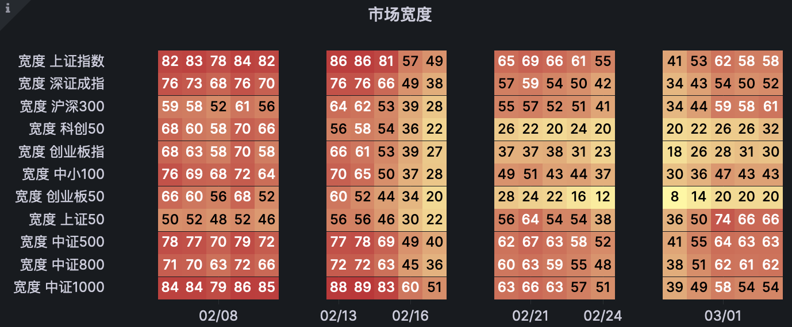

> 生命中最重要的是给这个世界留下有点有价值的东西！ FOR USELF 

# 工作内容

- 随便写写吧

- 趁着兴趣还在，把  todo里面的几个工作完成

- 感觉做的事情还是有点意义的

- 加油 孩子！

## 2023年02月04日17:57:27

正月十四

癸卯年 兔

甲寅月 癸巳日

> 明天就 15了 真快 ！ 一直没有把自己照顾好，深深自责 ；也不想耽误了，求拯救。
> 
> 程序员相对于艺术家来说，天马星空的思想不好实现；计划和能力只能局限于现有的框架之内，可以让他符合他的数学逻辑；表达不了心情；就像打印的文字一样，只能让你知道故事情节；感受不到手写，绘画时笔者的真是感受；手工做的完美性是无法复制的，一旦可以量化，可以计算，什么都可以千万亿倍的复制放大，只要不是实物，文字 byte 的clone copy 更是廉价，只占用一些公共存储罢了！！
> 
> 手工，电子化，程式化，可以完美结合多好；

## 2023年02月04日21:23:17

遇到一个好的博客，自己搭建的；还是个搞艺术的，合适惊讶于佩服；博客干干净净的，

[# 邓邓的流水账](https://nav.xhhdd.cc/)

[千千结 - 邓邓的流水账](https://xhhdd.cc/index.php/cross.html)

看完她的博客，很有感受呀；

个人博客，建站这么好的真的第一次见，现在工作了，都很浮动，尤其像我现在这样码字记流水账的更不多了，真是觉得欢喜。

这个也引导我后面的发展往哪里发展，个人博客，公司网站风格；

还是一成不变的gitbook风格，

真是优秀呀！！！ 佩服 

推荐，推荐！！！

:dog:

mail：[wiki@kv.mk](https://mail.qq.com/)

github：[xhhdd/Aurality](https://github.com/xhhdd/Aurality)

blog：[xhhdd.cc](https://xhhdd.cc)

### 邀链

友链申请,已添加大佬友链
名称:希戈㐷boxtrade
地址:https://boxtrade.github.io/
头像:https://avatars.githubusercontent.com/u/120550368?s=200&v=4
内容: 学习 工作 生活 

2023年02月04日22:44:08

- 添加链接 https://boxtrade.github.io/donate/README 个人组织主页

- 开发本地模式和线上远程模式，两种即开即用的 前端应用

DEMO 网站 

- [marktext/docs at develop · chenGit1763113879QQ/marktext · GitHub](https://github.com/chenGit1763113879QQ/marktext/tree/develop/docs)

- [GitHub - chenGit1763113879QQ/404StarLink: 404StarLink - 推荐优质、有意义、有趣、坚持维护的安全开源项目](https://github.com/chenGit1763113879QQ/404StarLink)

## 2023年02月05日17:38:37

好有成就感，目标已经达成；线上远程模式 docsify 基本可用；

## 捐献项目要钱

### 404starLink

你好，最近利用贵仓库的知识库做了一个介绍网站 [404StarLink-wiki](https://chengit1763113879qq.github.io/404StarLink-wiki/#/)，如果你觉得有用可以fork me 或者 [buy a coffee for me](https://boxtrade.github.io/donate/README) ! 如果需要帮助，可以直接在仓库下留言。

Hello, recently used your repository's knowledge base to make an introduction site [404StarLink-wiki](https://chengit1763113879qq.github.io/404StarLink-wiki/#/), if you find it useful you can fork me or [buy a coffee for me]( https://boxtrade.github.io/donate/README) ! If you need help, you can leave a message directly under the repository.

### marktext-wiki

Contribute a web wiki 

    你好，最近利用贵仓库的知识库做了一个介绍网站 [marktext-wiki](https://boxtrade.github.io/marktext-wiki/#/)，如果你觉得有用可以 [fork me](https://github.com/boxtrade/marktext-wiki) 后重新部署或者 [buy a coffee for me](https://boxtrade.github.io/donate/README) ! 如果需要帮助，可以直接在仓库下留言。

    Hello, recently used your repository's knowledge base to make an introduction site  [marktext-wiki](https://boxtrade.github.io/marktext-wiki/#/) , if you find it useful you can [fork me](https://github.com/boxtrade/marktext-wiki)   and redeploy  or [buy a coffee for me](https://boxtrade.github.io/donate/README) ! If you need help, you can leave a message directly under the repository.

### open api cook

 Contribute a web wiki

    Hello, recently used your repository's knowledge base to make an introduction site [openai-cookbook-wiki](https://boxtrade.github.io/openai-cookbook-wiki/#/) , if you find it useful you can [fork me](https://github.com/boxtrade/openai-cookbook-wiki) and redeploy or [buy a coffee for me](https://boxtrade.github.io/donate/README) ! If you need help, you can leave a message directly under the repository.

But Files of type ipynb cannot be displayed yet, and I will fix it later

   你好，最近利用贵仓库的知识库做了一个介绍网站 [https://boxtrade.github.io/openai-cookbook-wiki/#/，如果你觉得有用可以](https://boxtrade.github.io/openai-cookbook-wiki/#/%EF%BC%8C%E5%A6%82%E6%9E%9C%E4%BD%A0%E8%A7%89%E5%BE%97%E6%9C%89%E7%94%A8%E5%8F%AF%E4%BB%A5) [fork me](https://github.com/boxtrade/marktext-wiki) 后重新部署或者 [buy a coffee for me](https://boxtrade.github.io/donate/README) ! 如果需要帮助，可以直接在仓库下留言。

2023年02月05日19:50:07 

### 等待佳音 今天完成了三个在线网站  wiki

- [Contribute 404StarLink-wiki web · Issue #97 · knownsec/404StarLink · GitHub](https://github.com/knownsec/404StarLink/issues/97) 

- [Contribute a web wiki ； i love this soft 😃 : · Issue #3570 · marktext/marktext · GitHub](https://github.com/marktext/marktext/issues/3570)

-  [Contribute a web wiki · Issue #110 · openai/openai-cookbook · GitHub](https://github.com/openai/openai-cookbook/issues/110)

### 自助建站测试

- https://chengit1763113879qq.github.io/404StarLink-wiki/#/

- [marktext-wiki](https://boxtrade.github.io/marktext-wiki/#/)

### issue 反馈

- 前段运行出现偶尔刷新不出来主页的问题

- 还会报跨域的错误 

- 整体体验不好，自己测试的 都会出现 

- todo 待优化 找个合作者 

# CHATGPT

## Q1 OpenAI's services are not available in your country. ???

当前任务 

找出  githu 文件列表的api 

配置参考 

```js
      // Docsify configuration
      window.$docsify = {
        alias: {
          '.*?/awesome':
            'https://raw.githubusercontent.com/docsifyjs/awesome-docsify/master/README.md',
          '.*?/changelog':
            'https://raw.githubusercontent.com/docsifyjs/docsify/master/CHANGELOG.md',
          '/.*/_navbar.md': '/_navbar.md',
          '/es/(.*)':
            'https://raw.githubusercontent.com/docsifyjs/docs-es/master/$1',
          '/de-de/(.*)':
            'https://raw.githubusercontent.com/docsifyjs/docs-de/master/$1',
          '/ru-ru/(.*)':
            'https://raw.githubusercontent.com/docsifyjs/docs-ru/master/$1',
          '/zh-cn/(.*)':
            'https://cdn.jsdelivr.net/gh/docsifyjs/docs-zh@master/$1',
        },
```

## vue 遍历文件参考[DayLearnNote/getDirStruct.js at master · accforgit/DayLearnNote · GitHub](https://github.com/accforgit/DayLearnNote/blob/master/getDirStruct.js)

# chatgpt 一出世就很火的工具 ，一会看下

# 日历

> 工具复制自[negui](https://wannianli.negui.com/)

| 星期一          | 星期二           | 星期三          | 星期四          | 星期五          | 星期六                  | 星期日          |
| ------------ | ------------- | ------------ | ------------ | ------------ | -------------------- | ------------ |
| 30<br>初九     | 31<br><br>初十  | 1<br><br>十一  | 2<br><br>十二  | 3<br><br>十三  | 今<br><br>4<br><br>立春 | 5<br><br>元宵节 |
| 6<br><br>十六  | 7<br><br>十七   | 8<br><br>十八  | 9<br><br>十九  | 10<br><br>二十 | 11<br><br>廿一         | 12<br><br>廿二 |
| 13<br><br>廿三 | 14<br><br>情人节 | 15<br><br>廿五 | 16<br><br>廿六 | 17<br><br>廿七 | 18<br><br>廿八         | 19<br><br>雨水 |
| 20<br><br>初一 | 21<br><br>龙抬头 | 22<br><br>初三 | 23<br><br>初四 | 24<br><br>初五 | 25<br><br>初六         | 26<br><br>初七 |
| 27<br><br>初八 | 28<br><br>初九  | 1<br><br>初十  | 2<br><br>十一  | 3<br><br>十二  | 4<br><br>十三          | 5<br><br>十四  |

# 2023年02月20日15:31:51

## 页面设计

- 主页

- 目录页

- 详情页

- 登录 自选；自选分组

- 新闻资讯页

- 

# 2023年02月21日08:59:23 建站的迷茫

1. 页面展示的重要性，？？不重要，其他免费产品替代

2. 告警，检测通知。登记，重要，有个页面点一下更好；设置下范围，告警方式

3. 技术指标描述 

# 玻璃 纯碱

房地产系数影响较大 

差值在收盘前三分钟开始不稳定，挑战极值 

```shell
时间 2023-02-21 14:56:56, 当前国内期货 玻璃2305 主力价格：1555.00;
时间 2023-02-21 14:56:56, 当前国内期货 纯碱2305 主力价格：2987.00;
纯碱玻璃价比例： 1.92090
纯碱玻璃价差： 1432.00
```

# 数据相关性

[Java 做相关性分析_jsci.maths.statistics.tdistribution的依赖_天弃2的博客-CSDN博客](https://blog.csdn.net/weixin_50627332/article/details/127193779)

## 皮尔逊（pearson）相关系数

https://zhuanlan.zhihu.com/p/584636705

## Spearman(斯皮尔曼相关性系数)

https://zhuanlan.zhihu.com/p/581986411

## [Java 使用 Apache commons-math3 线性拟合、非线性拟合实例（带效果图）](https://www.cnblogs.com/wufeiwua/p/15110699.html)

https://www.cnblogs.com/wufeiwua/p/15110699.html

# JVM 堆外内存

[员工关键业绩指标，关键业绩指标和关键绩效指标（带你认识JDK8中超nice的Native）_犇涌向乾](http://www.029ztxx.com/tg/1674123045865036.html)

# 项目模块设想

- 用户模块

- 产品模块

- 行情模块

- 策略

- 要闻

- 留言讨论

- 博客

[Discuz! 安装向导](http://121.43.55.160:88/install/index.php?method=ext_info)

https://discuz.com/docs-v1/install_bt_linux.html

2023年03月01日10:06:34

近期的目标，简单页面展示产品，行情；产品介绍。

相关系数 指数预测！！

tradeview 展示页

数据存储展示页

实时数据

产品目录

# tradingview踩坑心得

**一、简介**　　tradingview是一个非常强大的图表插件，主要用于经济类的图表展示，尤其是k线图，很多行情网站的k线都可以看到是用的tradingview。最近公司有项目用到了这款插件，在摸索过程中踩了很多的坑，这里就总结一下，写一篇踩坑的心得，不过前端的技术栈很复杂，tradingview的功能也非常多，所以这里只说下我用的框架和业务接触到的功能，大家多多交流学习～　　首先是申请使用，使用是免费的（当然申请完成之后，也可以付费升级成专业版），申请流程有点繁琐，要以公司的名义提交申请，之后会收到协议，然后打印、签字、盖章再拍照发回去什么的。。通过之后就可以收到tradingview的github地址了，可以把代码clone下来了，之后也可以随着官方的发布随时更新，还是很方便的。　　然后就可以开始上手使用了，这里先贴一下官方的攻略：      https://github.com/zlq4863947/tradingViewWikiCn    //wiki是官方在维护的开发文档，不过是英文的，这是大佬翻译的中文版  
      https://github.com/tradingview/charting-library-examples     //这是官方给出的demo，包含了现在各大主流前端框架的写法

# TRADEVIEW 类似网站

[图表 - PonentStock](https://ponentstock.com/chart#!)

https://zhuanlan.zhihu.com/p/568771958

https://touzitools.com/#term-15

2023年03月02日11:03:02

前端有一种无从下手的感觉，需要找一个合作伙伴！

https://github.com/liihuu/KLineChart

试用下这个框架，不贪多了！ 

# jvm 内存回收

[记一次 CMS GC导致 FULL GC 时间开销很大的排查_fullgc耗时过长_Agly_Charlie的博客-CSDN博客](https://blog.csdn.net/Agly_Clarlie/article/details/122082067)

[java use g1_深入理解 Java G1 垃圾收集器_诚毅学长的博客-CSDN博客](https://blog.csdn.net/weixin_35063366/article/details/114625944)

https://www.cnblogs.com/riches/p/14674052.html

https://wenku.baidu.com/view/9be1e76be618964bcf84b9d528ea81c758f52e7b.html?_wkts_=1677727537941&bdQuery=G1%E5%9E%83%E5%9C%BE%E6%94%B6%E9%9B%86%E5%99%A8+%E9%85%8D%E7%BD%AE

[十二、G1垃圾收集器_-xx:+useg1gc_Lundy_H的博客-CSDN博客](https://blog.csdn.net/weixin_40181736/article/details/126795766)

# 行情数据接口

[腾讯股票接口、和讯网股票接口、新浪股票接口、雪球股票数据、网易股票数据丶Java教程网-IT开发者们的技术天堂](https://www.liangzl.com/get-article-detail-14585.html)

# 量化资料 网站

https://zhuanlan.zhihu.com/p/577183543

## 哥们开源项目把握删除了 我 很郁闷 ！！！

# # tradingview

https://zhuanlan.zhihu.com/p/159996232?utm_source=wechat_session

# demo 网站 参考

https://github.com/ibaihuo/chanvis

# 开源想法 ；

众人拾柴火焰高 ！！！小而美 

# grafana

## [演示 demo play ](https://play.grafana.org/dashboards)

#### [社区 Grafana Labs Community Forums](https://community.grafana.com/latest)

# candlestick 真心喜欢

[Grafana](https://play.grafana.org/d/candlestick/candlestick?orgId=1)

[Candlestick | Grafana documentation](https://grafana.com/docs/grafana/latest/panels-visualizations/visualizations/candlestick/)

[Mac上安装Grafana_huan_1993的博客-CSDN博客](https://blog.csdn.net/fu_huo_1993/article/details/114915310#:~:text=Mac%E4%B8%8A%E5%AE%89%E8%A3%85Grafana%201%20%E4%B8%80%E3%80%81%E8%83%8C%E6%99%AF%202%20%E4%BA%8C%E3%80%81%E5%AE%89%E8%A3%85%E6%AD%A5%E9%AA%A4%203%201%E3%80%81%E9%80%9A%E8%BF%87%20Home,node-exporter%20%E7%9A%84%E5%9B%BE%E8%A1%A8%201%E3%80%81%E5%9C%A8%E7%BD%91%E7%AB%99grafana%E7%BD%91%E7%AB%99%E4%B8%8A%E6%90%9C%E7%B4%A2%202%E3%80%81%E5%A4%8D%E5%88%B6%E5%9B%BE%E8%A1%A8id%203%E3%80%81grafana%E5%AF%BC%E5%85%A5%E5%9B%BE%E8%A1%A8%204%E3%80%81%E6%9F%A5%E7%9C%8B%E5%9B%BE%E8%A1%A8%205%20%E5%9B%9B%E3%80%81%E5%8F%82%E8%80%83%E9%93%BE%E6%8E%A5)

https://grafana.com/grafana/download?pg=get&plcmt=selfmanaged-box1-cta1&platform=mac

curl -O https://dl.grafana.com/enterprise/release/grafana-enterprise-9.4.3.darwin-amd64.tar.gz  
tar -zxvf grafana-enterprise-9.4.3.darwin-amd64.tar.gz

### mac 启动与安装

[Install on macOS | Grafana documentation](https://grafana.com/docs/grafana/latest/setup-grafana/installation/mac/)

To start Grafana service, go to the directory and run the command:

```bash
./bin/grafana-server web
```

## heatmap 热力图 搞了很久，也没有成功 这个先放弃 后面有时间 在搞下

真的无语了，不就是一个三维数据吗？

2023年03月06日00:44:33 愿望达成，妈的 我都佩服我自己 真好看！

某天夜里，真为自己高兴！



z

## plugins

chenzhongqiangdeMacBook-Pro:~ chenzhongqiang$ /Users/chenzhongqiang/developsoft/monitor/grafana-9.4.3/bin/grafana-cli  plugins install grafana-simple-json-datasource

✔ Downloaded and extracted grafana-simple-json-datasource v1.4.2 zip successfully to /usr/local/var/lib/grafana/plugins/grafana-simple-json-datasource

Please restart Grafana after installing plugins. Refer to Grafana documentation for instructions if necessary.

### 数据处理插件 infinity

https://sriramajeyam.com/grafana-infinity-datasource/wiki/json/

https://sriramajeyam.com/grafana-infinity-datasource/wiki/csv/

## # Grafana内置参数，以及查询Prometheus参数

https://blog.csdn.net/java_4_ever/article/details/108582949

Grafana内置参数

$__dashboard
当前dashboard的名称

$__from $__to
时间范围的毫秒值
可自定义格式，比如:{$__from: date :YYYY-MM-DD HH:mm:ss} {$__from: date :seconds}

$__interval
查询的时间间隔，包含单位，比如：30s，2m

$__interval_ms
查询的时间间隔，毫秒值

$__range
查询的时间区间大小，包含单位，比如：2d

$__range_s $__range_ms
查询的时间区间大小，分别是秒数和毫秒数

$__timeFilter
返回当前选择的时间范围表达式，比如：time > now() -7d，常用于数据库作为datasource的时候。

————————————————
版权声明：本文为CSDN博主「java_4_ever」的原创文章，遵循CC 4.0 BY-SA版权协议，转载请附上原文出处链接及本声明。
原文链接：https://blog.csdn.net/java_4_ever/article/details/108582949

# json-path

## # Ability to select map keys #439

json-path 取key值，$.person[*~]

https://github.com/json-path/JsonPath/issues/439

`$.person[*~]` seems to work in the online jsonpath evaluator. (jsonpath.com).

## 下拉框

[Grafana配置数据源，自定义查询语法_grafana query语法_山东梅长苏的博客-CSDN博客](https://blog.csdn.net/qq_23598037/article/details/99850396)

## 计划

- [ ] 下拉框构建，多模板 宽度图
- [ ] 交易所选项，产品选项，
- [ ] 后期考虑产品类别，或者tag 
- [ ] 选择一个带技术指标的 数据源
- [ ] 完善蜡烛图的技术指标展示，目前有一个boll 加sar 就完美了 

# grafana 时间参数

[证券交易软件下载-国信证券公司官网](https://www.guosen.com.cn/gs/software/detail.html?id=43)

| 句法                       | 示例结果                     | 描述                                                                                                             |
| ------------------------ | ------------------------ | -------------------------------------------------------------------------------------------------------------- |
| `${__from}`              | 1594671549254            | Unix 毫秒纪元                                                                                                      |
| `${__from:date}`         | 2020-07-13T20:19:09.254Z | 无参数，默认为 ISO 8601/RFC 3339                                                                                      |
| `${__from:date:iso}`     | 2020-07-13T20:19:09.254Z | ISO 8601/RFC 3339                                                                                              |
| `${__from:date:seconds}` | 1594671549               | Unix 秒纪元                                                                                                       |
| `${__from:date:YYYY-MM}` | 2020-07                  | 任何不包含该字符的自定义[日期格式](https://links.jianshu.com/go?to=https%3A%2F%2Fmomentjs.com%2Fdocs%2F%23%2Fdisplaying%2F)`:` |

上面的语法也适用`${__to}`。

作者：文儿哥  
链接：https://www.jianshu.com/p/8817d6bbc90e  
来源：简书  
著作权归作者所有。商业转载请联系作者获得授权，非商业转载请注明出处。

# grafana 配置

https://liumiaocn.blog.csdn.net/article/details/104027047

# 正则

https://regex101.com/

## 匹配数字

\d+(\.\d+)?\,? 

# 期货人常用的网站都在这里了【建议收藏】

https://mp.weixin.qq.com/s?__biz=MjM5NjY4NDE2MQ==&mid=2652664606&idx=1&sn=6fc16adaf3c79c9cf41db53228d4e030&chksm=bd0d5bf08a7ad2e62f6fd0633f3f0f04bc1609cc900bfd87dbef76f7ab3f2c44c5b6e0e57e7f&scene=27

http://www.5566.net/qh-.htm

[新浪期货行情](https://vip.stock.finance.sina.com.cn/mkt/#bl_qh)

# 问题

- [ ] 蜡烛图无数据的地方怎么去除？
- [ ] 同一个面板，怎么展示不同的数据？？
- [ ] 数据展示的模式 
- [ ] 复合图表 📈 多维度 技术指标
- [ ] 后台数据 技术指标 支持 
- [ ] 对冲，关联交易数据 查询 
- [ ] 尝试 一个图表，显示所有的同类期货 产品 走势 
- [ ] 待办 交易所，产品 网页 
- [ ] 告警配置？？？  todo top 
- [ ] grafanan 怎么移植 同步  ？？
- [ ] 机器人接入，同花顺，chat-gpt ??? todo 
- [ ] 

# 指标研究

- - [ ] 布林线参数的区别??

# 组建社区 grafana

# 路线确定

> 之前很长一段时间，也在徘徊；是否要做一个行情网站；恰好在网站上遇到另外一个 tradeview 爱好者，做的网站和数据源在国内都是很好的，有时候柑橘真是无私奉献了；
> 
> 我继续的路线 还是 策略，自动化；模型交易；
> 
> 数据基础，后面有条件了，可以直接买入！
> 
> 任重而道远，加油；
> 
> 这条路只有稳中求胜 
> 
> 希望认识更多的朋友，见到更多的山峰，回望人生不遗憾！
> 
> 加油！！

# 交易焦虑

可以让机器 程序化 代替人的焦虑，做成一定的止损，止盈，分析 策略；自动化分析

自动化 发布

### 2023年03月15日15:00:00

- [ ] grafanan 移植部署

- [ ] 交易所列表

- [ ] 

# mysql  # 创建MySQL只读权限用户

[创建MySQL只读权限用户_mysql创建只读用户_leejie*.的博客-CSDN博客](https://blog.csdn.net/weixin_43573186/article/details/121607548)

```mysql
SELECT user,host FROM mysql.user;
SELECT * FROM mysql.user WHERE user='root';

-- 1  创建一个用户 
CREATE USER 'readonly'@'%' IDENTIFIED BY '123456';
-- 2、给用户赋予只读权限
GRANT SELECT ON stock_trade.* TO 'readonly'@'%'; 
-- 3、刷新权限
FLUSH PRIVILEGES;
```

## 创建 所有权限授予新创建的用户

```sql
create user  vn@'%' identified by '123456';

GRANT ALL PRIVILEGES ON *.* TO vn@'%';

FLUSH PRIVILEGES; 
```

## 参考

[# MySQL 创建用户 | Mysql Create User](https://mp.weixin.qq.com/s?__biz=MzU5NzUxMzEzNQ==&mid=2247489709&idx=5&sn=d13933fd9eec7682b762c97f63439346&chksm=fe531e6dc924977b99be6c4cc754fb7cdc4909def1de1d2b9e6ee4210b0e3fa5e02ad23ad44c&scene=27)

# grafana 小技巧

## 表格字段属性重写

可以重新 定义  cell属性 

# 工作重点 -- 寻找盈利机会，力争每天都有正收益

- 策略

- 回测

- 实盘

- 程序语言，java ,python

# 创业思路 想法

- 基础生活保障 吃喝拉撒穿住用 

- 团队合作 找各种各样的人一起来帮忙 

- 公司盈利点思考

# 数据服务

提供免费的历史数据查询 

# 安装 Homebrew

https://brew.sh/index_zh-cn

```cmd
/bin/bash -c "$(curl -fsSL https://raw.githubusercontent.com/Homebrew/install/HEAD/install.sh)"
```

https://zhuanlan.zhihu.com/p/438515593

中科大 快一点 

https://zhuanlan.zhihu.com/p/111014448

# python

## # macos下python安装tkinter

找了半天折腾各种奇淫巧技，最后其实很简单

```bash
brew install python-tk
```

via https://stackoverflow.com/questions/61218237/how-can-i-install-tkinter-for-python-on-mac

## # python 更换国内镜像源

[python 更换国内镜像源_python切换镜像源_刘墨苏的博客-CSDN博客](https://blog.csdn.net/m0_50679156/article/details/116230889)

```
pip config set global.index-url https://pypi.mirrors.ustc.edu.cn/simple/
```

https://zhuanlan.zhihu.com/p/451550125

```python3
pip config set global.index-url  https://pypi.org/simple  
```

# ## 解决 MacOS BigSur 使用 pip 安装依赖失败的问题  invalid version number in 'MACOSX_DEPLOYMENT_TARGET=13'

      clang: error: invalid version number in 'MACOSX_DEPLOYMENT_TARGET=13'

https://xkcoding.com/2021/03/10/fix-error-about-python-package-install-on-big-sur.html

https://stackoverflow.com/questions/63972113/big-sur-clang-invalid-version-error-due-to-macosx-deployment-target

# 单身电影

[电影《和莎莫的500天》HD在线观看-西蒙影院](https://tv.cvvision.cn/v/22714_1_1.html)

# # Python 的 setup.py

```text
$ python setup.py install
```

https://zhuanlan.zhihu.com/p/276461821

# # 释放 Mac 上的储存空间

# https://support.apple.com/zh-cn/HT206996

尴尬，😓 

买的电脑256g的硬盘，远远不够用啊 

想换电脑了

买个服务器  巨无霸级别的  

最近想部署 微服务，人人为我，我为人人 

# # Mac打不开Anaconda-Navigator的解决办法！

https://zhuanlan.zhihu.com/p/452685170

# # 用数据告诉你 Python 代码比 Java 慢 100 倍！

https://cloud.tencent.com/developer/article/1558841

# # anaconda设置中文方法分享

[anaconda�������ķ�������-̫ƽ�������](https://pcedu.pconline.com.cn/1428/14284149.html)

# [MySQL 设定、修改字符集_mysql修改字符集_veejaLiu的博客-CSDN博客](https://blog.csdn.net/u014565127/article/details/120076506)

```sql
ALTER DATABASE 数据库名 DEFAULT CHARACTER SET utf8mb4 COLLATE utf8mb4_general_ci;

ALTER TABLE 表名 CONVERT TO CHARACTER SET utf8mb4 COLLATE utf8mb4_general_ci;


show variables where Variable_name like 'collation%';

ALTER DATABASE stock_trade DEFAULT CHARACTER SET utf8mb4 COLLATE utf8mb4_general_ci;


ALTER TABLE t_futures CONVERT TO CHARACTER SET utf8mb4 COLLATE utf8mb4_general_ci;
```

# grafana 下拉框链接 教程

### 下拉框 值和 value

/(?<value>[^-]+)|--(?<text>[^]+)/g

### 变量名 market = '${exchange}'

## [Grafana系统的备份、恢复、迁移](https://baijiahao.baidu.com/s?id=1674054707827211417&wfr=spider&for=pc)

备份grafana目录中的grafana.db（一般情况下路径：/var/lib/grafana/grafana.db）

备份插件目录plugins（一般情况下路径为：/var/lib/grafana/plugins）

备份Grafana配置文件：/etc/grafana/grafana.ini

# 量化框架

[Installation - Backtrader](https://www.backtrader.com/docu/installation/)

# 2023年03月22日11:17:46 近期目标

- python askshare 数据 入库 mysql 

- backtrader 回测框架学习

- springcloud 注册中心建立 

- java 项目 架构梳理 

- python 相关性

- 眼下交易 玻璃期货 行情查看 ``

# 2023年03月22日13:28:42

https://ponentstock.com/

首先要承认一个现实，最近为了行情数据弄的焦头烂额的；可是最近看大了，老哥的网站，不由得眼前一亮。

人无我有，人有我精。

那现在没有别人做的好，打不不过就加入。

完成那个 属于自己特色的事务。 将优点发挥到极致，最近行情的数据 就看到这里吧

行情中心的事项 暂缓。

先做策略，相关性，对冲交易对 研究 。

目前方向 投研 

# # 解决Github报错HTTP/2 stream 1 was not closed cleanly before end of the underlying stream

https://blog.csdn.net/u011426236/article/details/129104875

# # 全球九大主流编程语言

https://zhuanlan.zhihu.com/p/46956255

# python 常用工具

## # [使用SQLAlchemy操作MySQL](https://www.cnblogs.com/jclian91/p/12121735.html)

https://www.cnblogs.com/jclian91/p/12121735.html

[python常用的量化金融库_finta库_星空下0516的博客-CSDN博客](https://blog.csdn.net/qq_28531269/article/details/120763451)

# 行情数据

 akshare 数据质量太差 

https://tushare.pro/

数据参考 

### 行情 数据计划

做社区开源，利用github gitee 做一个数据存储，字典数据，

行情数据沿用 接口调用，或者找老哥合作 问老哥要一个行情数据 

原数据主体  java处理 并提供数据 

扩展课提供 python api 套件 

轻应用，制作数据转发 

# 重启 Spring cloud 计划

[关于TensorFlow | TensorFlow中文官网](https://tensorflow.google.cn/?hl=zh-cn)


# 2023年04月17日17:27:55

# grafana 上生产


https://grafana.com/grafana/download

```shell
wget https://dl.grafana.com/enterprise/release/grafana-enterprise-9.4.7.linux-amd64.tar.gz
tar -zxvf grafana-enterprise-9.4.7.linux-amd64.tar.gz

```

### Execute the binary  [执行](https://grafana.com/docs/grafana/latest/setup-grafana/installation/rpm/#execute-the-binary)

```bash
./bin/grafana-server web
```

# [Grafana数据迁移](https://www.cnblogs.com/zeq912/p/11089026.html)

https://www.cnblogs.com/zeq912/p/11089026.html


# # mysql设置允许外部访问

```sql
update user set host='%' where user ='root';
FLUSH PRIVILEGES;
```
